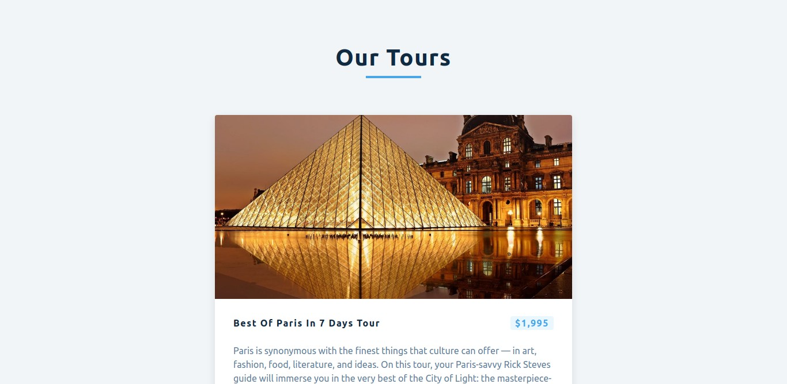

# Tours-Page
this is a Responsive Webpage For tours page finder




## Built with

- ReactJs
- DOM properties and attributes
- HTML & Css
- BootStrap 5
- Pure JavaScript


## Getting Started
To get a local copy of the repository please run the following commands on your terminal:
- ```$ cd <folder>```
- ```$ git clone https://github.com/medobarakat/Tours-Page.git ```
- ```$ cd Tours-Page ```


## Authors

👤 **Ahmed Barakat**
- Github: [@medobarakat](https://github.com/medobarakat)

- Linkedin: [Ahmed Barakat](https://www.linkedin.com/in/ahmed-barakat-dev/)

- Email: [My Gmail](ahmedbarakat2401@gmail.com)

##    Contributing

Contributions, issues and feature requests are welcome!

## Show your support

Give a ⭐️ if you like this project!
